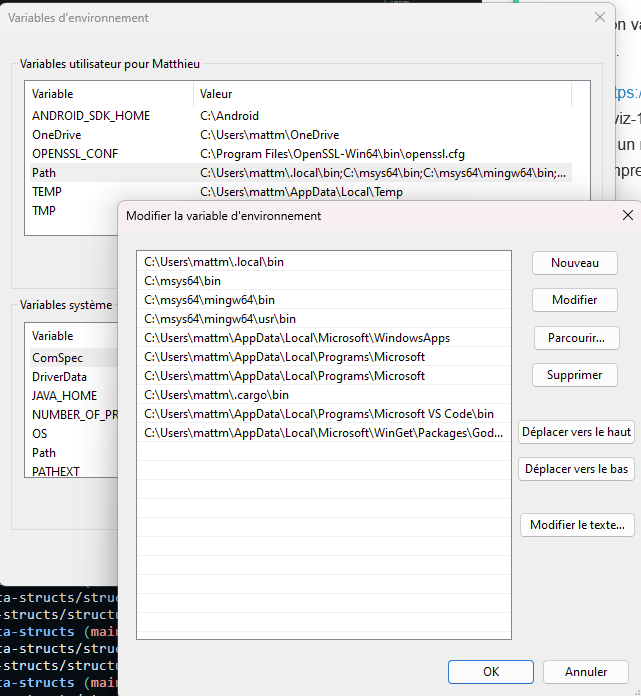

# Structures de données

Dans ce repo, vous implémenterez les structures de données et algorithmes du cours.

!!! todo Pré-requis
    UV est installé sur votre machine.


!!! hint Préparer l'environnement python
    Commandes uv:

    Installer python 3.13
    ```
    uv python install 3.13
    ```
    Créer un projet uv
    ```
    uv init
    uv python pin 3.13
    ```
    installer la librairie graphviz pour dessiner les arbres (anciennement pip install)
    ```
    uv add graphviz
    ```

    Ne pas oublier de sélectionner cet environnement en bas à droite de vscode.

!!! hint graphviz
    Le module graphviz discute avec le programme graphviz qui a besoin d'être installé sur votre poste.
    
    Chez vous:
    ```
    winget install graphviz
    ```

    Au lycée, on va en profiter pour faire des manips sur le système d'exploitation, vu que graphviz est riquiqui.

    - Sur https://graphviz.org/download/, téléchargez le zip de la dernière version de graphviz: graphviz-12.2.0 (64-bit) ZIP archive
    - Créez un répertoire TOOLS dans P:\Documents
    - Décompressez le fichier dans ce répertoire.
    
    Les outils graphviz sont maintenant sur l'ordinateur, ce sont les fichiers .exe qui sont dans P:\Documents\TOOLS\Graphviz-12.2.0-win64\bin\

    Lorsqu'un humain dans la console ou qu'un processus comme python veut exécuter graphviz sans préciser où il est, il faut ajouter ce répertoire au PATH de l'utilisateur.

    Dans la loupe de windows, cherchez "variable". Il vous propose 2 choses: modifier les variables au niveau système (on peut pas), ou au niveau utilisateur. C'est ce qu'on veut.

    Il faut double cliquer sur PATH, et on obtient la fenêtre suivante.
    
    Dans cette fenêtre cliquer sur nouveau, collez le chemin d'accès au répertoire bin, et faites OK.

    


!!! danger Relancez VSCode

!!! info Tests
    Lancez la commande:
    ```
    uv run -m structures.lineaires.files
    ```
    Vérifiez la bonne exécution des tests

    Lancez la commande:
    ```
    uv run -m structures.hierarchiques.arbrebin_immuable
    ```
    Vérifiez la bonne exécution des tests ainsi que la création d'un fichier png à la racine du répertoire, contenant l'image de l'arbre exemple.
